> [!IMPORTANT]
> **Note for reviewers — use these links**
>
> The original Vercel deployment URL submitted with this project is **no longer active** (platform pruning of temporary deploy links).
>
> | Resource | Link |
> |:---------|:-----|
> | **Live production demo** | [https://sentinel-ai-behavioral-threat-detec.vercel.app/](https://sentinel-ai-behavioral-threat-detec.vercel.app/) |
> | **Demo video** | [Watch on Google Drive](https://drive.google.com/drive/folders/1lx4J1kTKugMUaBTTGAO9ncda5uuYa4Xy?usp=sharing) |

# SentinelAI

<p align="center">
  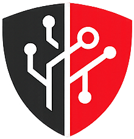
</p>

<p align="center">
  <strong>Behavioural anomaly detection and risk intelligence for security operations.</strong>
</p>

<p align="center">
  Unsupervised detection · Deterministic risk · MITRE mapping · Cold-start & drift · SOC investigation
</p>

---

## What it is

SentinelAI is an end-to-end platform that turns employee activity into actionable threat cases. It scores how anomalous a session looks, fuses that signal with enterprise rules into a risk level, classifies likely attack behaviour, maps MITRE ATT&CK techniques, and explains the finding for an analyst — all through a FastAPI backend and a React SOC workspace.

It answers a practical SOC question:

> Given one employee’s activity on one simulation day, how anomalous is the behaviour, how severe is the enterprise risk, and why?

**Detection is unsupervised** (Behavioural Transformer). **Risk, attack labels, and recommendations are deterministic** — no attack ground-truth leakage into live scoring.

---

## Highlights

| Area | Capability |
|------|------------|
| Detection | Behavioural Transformer (reconstruction + attention) |
| Risk | Deterministic LOW / MEDIUM / HIGH / CRITICAL scoring |
| Classification | Rule-based attack types + MITRE ATT&CK mapping |
| Explainability | Plain-language summary, factors, observations, recommended response |
| Adaptation | Cold-start score shrink + per-entity EWMA concept-drift tracking |
| Evidence | Behaviour timeline + interactive attention map |
| Evaluation | Offline P/R/F1, type accuracy, FPR @ top 1%/5% vs simulator GT |
| Ingest | Excel workbook upload or built-in sample batch |
| Surfaces | React SOC app, FastAPI OpenAPI docs, optional Next.js marketing site |

---

## Architecture

<p align="center">
  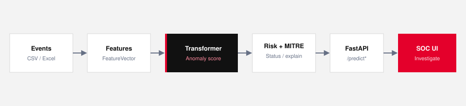
</p>

```mermaid
flowchart LR
  A[Events / Excel / CSV] --> B[Feature engineering]
  B --> C[Behavioural Transformer]
  C --> F[AnomalyPrediction]
  F --> CS[Cold-start + drift]
  CS --> G[Risk engine]
  G --> H[Attack + MITRE]
  H --> I[Explainability]
  I --> J[FastAPI /predict*]
  J --> K[SOC dashboard]
```

### Inference chain (API)

1. Load detector from `SENTINELAI_MODEL_PATH` (never trains at request time)
2. Score anomaly → normalized score + `is_anomaly`
3. Cold-start shrink (thin history) + EWMA concept-drift dampening
4. Risk engine → score, level, recommendation
5. Attack classification → type + matched signals
6. MITRE mapping → tactic / technique
7. Final SOC status → Normal / Suspicious / Under Investigation / Confirmed Threat
8. Explainability (+ Transformer behaviour insight, timeline errors, attention when available)

---

## SOC analyst workflow

<p align="center">
  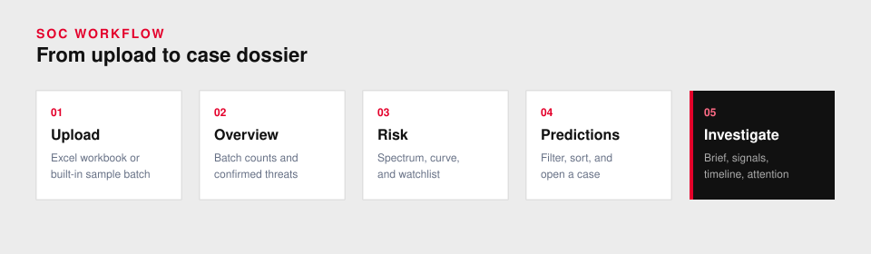
</p>

| Step | Route | Purpose |
|------|-------|---------|
| 01 Upload | `/app` | Load Excel or sample feature vectors |
| 02 Overview | `/app/overview` | Batch totals and confirmed threats |
| 03 Risk | `/app/risk` | Spectrum, curve, watchlist |
| 04 Predictions | `/app/predictions` | Filter, sort, open a case |
| 05 Investigate | `/app/investigate` | Brief, signals, timeline, attention |
| System | `/app/system` | API health and session load |
| History | `/app/history` | Restore prior analysis reports |

---

## Repository layout

```text
SentinelAI-Behavioral-Threat-Detection/
├── README.md
├── requirements.txt
├── .env.example
├── run_backend.py                 # Start FastAPI (no training)
├── run_frontend.py                # Prints frontend run instructions
├── train_transformer_model.py     # Train Behavioural Transformer
├── calibrate_anomaly.py           # Calibrate score mapping
├── evaluate_detection.py          # Offline P/R/F1 + FPR@top-k% vs GT
├── integration.py                 # End-to-end Transformer demo (no UI)
├── synthetic_data/                # Active Python pipeline + API
│   ├── generators/                # Enterprise / profiles / timelines
│   ├── attacks/                   # Attack injection (incl. spoofing / low-and-slow / drift)
│   ├── adaptation/                # Cold-start + concept-drift EWMA
│   ├── evaluation/                # Imbalanced detection metrics
│   ├── streaming/                 # Near-real-time scoring adapter
│   ├── feature_engineering/       # FeatureVector construction
│   ├── behavioural_transformer/   # Model, train, dataset
│   ├── anomaly_detection/         # Shared AnomalyPrediction schema
│   ├── risk_engine/
│   ├── attack_classification/
│   ├── mitre/
│   ├── explainability/
│   └── api/                       # FastAPI app (synthetic_data.api.app)
├── frontend/                      # Vite + React SOC workspace
├── landing/                       # Next.js marketing site (optional)
├── models/                        # .pt / .meta.json artifacts
├── datasets/                      # employees, profiles, events CSVs
├── docs/                          # Diagrams + screenshots
├── tests/                         # pytest
└── backend/                       # Legacy scaffold (not used by run_backend.py)
```

---

## Technology stack

| Layer | Stack |
|-------|--------|
| Data & features | Python, pandas, numpy, Faker |
| Detection | PyTorch (Behavioural Transformer) |
| API | FastAPI, Pydantic, Uvicorn |
| SOC UI | React 19, TypeScript, Vite, Axios, Recharts, Framer Motion |
| Marketing | Next.js 14, Tailwind CSS |
| Tests | pytest |

---

## Prerequisites

- Python **3.11+**
- Node.js **18+** and npm
- Git

---

## Quick start

### 1. Clone and Python env

```bash
git clone <your-repo-url>
cd SentinelAI-Behavioral-Threat-Detection

python -m venv .venv

# Windows
.\.venv\Scripts\Activate.ps1

# macOS / Linux
source .venv/bin/activate

pip install -r requirements.txt
```

### 2. Environment

```bash
# Windows
copy .env.example .env

# macOS / Linux
cp .env.example .env
```

Minimal `.env`:

```env
SENTINELAI_MODEL_PATH=models/sentinelai_transformer.pt
API_HOST=127.0.0.1
API_PORT=8000
VITE_API_BASE_URL=http://127.0.0.1:8000
```

Optional:

```env
# (none required beyond the values above)
```

Also set `VITE_API_BASE_URL` in `frontend/.env` if you prefer app-local config.

**Production deploy (Vercel UI + Railway/Fly API):** see [`docs/deploy.md`](docs/deploy.md).

### 3. Model artifact

**Behavioural Transformer** (required):

```bash
# From synthetic timelines
python train_transformer_model.py

# Or from the checked-in events CSV
python train_transformer_model.py --from-events datasets/events.csv
```

Writes `models/sentinelai_transformer.pt` (+ metadata). Optionally calibrate:

```bash
python calibrate_anomaly.py
```

> The API **never retrains**. It only loads the configured Transformer artifact.

### 4. Start the backend

```bash
python run_backend.py
```

| URL | Purpose |
|-----|---------|
| http://127.0.0.1:8000/docs | OpenAPI / Swagger |
| http://127.0.0.1:8000/health | Liveness |
| http://127.0.0.1:8000/ | App metadata |

### 5. Start the SOC frontend

```bash
cd frontend
npm install
npm run dev
```

Open http://127.0.0.1:5173 — use **Upload** (or sample data), then walk Overview → Risk → Predictions → Investigate.

Helper (prints the same steps):

```bash
python run_frontend.py
```

### 6. Optional marketing site

```bash
cd landing
npm install
npm run dev
```

Open http://localhost:3000.

---

## API reference

| Method | Path | Description |
|--------|------|-------------|
| `GET` | `/` | Application metadata (`version` 2.0) |
| `GET` | `/health` | Liveness (model not required) |
| `POST` | `/predict` | Single feature vector → full case payload |
| `POST` | `/predict/batch` | Batch inference for SOC upload |

### Example — single prediction

```bash
curl -X POST http://127.0.0.1:8000/predict \
  -H "Content-Type: application/json" \
  -d "{\"feature_vector\":{\"employee_id\":\"EMP-001\",\"simulation_day\":\"2026-03-10\",\"total_events\":40}}"
```

Windows `cmd.exe`:

```bat
curl -X POST http://127.0.0.1:8000/predict ^
  -H "Content-Type: application/json" ^
  -d "{\"feature_vector\":{\"employee_id\":\"EMP-001\",\"simulation_day\":\"2026-03-10\",\"total_events\":40}}"
```

A successful response includes:

- `prediction` — raw / normalized anomaly scores  
- `risk_assessment` — score, level, recommendation  
- `attack_classification` — attack type + matched signals  
- `status` — final SOC status  
- `explanation` — summary, factors, observations  
- `mitre` — tactic / technique when mapped  
- `behaviour_insight` — timeline errors, attention, top events (Transformer)

---

## Frontend deep dive

### Pages

| Page | What you get |
|------|----------------|
| **Upload** | Drag-and-drop Excel or load sample vectors → `POST /predict/batch` |
| **Overview** | Employees, confirmed threats, high/critical counts, workflow CTAs |
| **Risk** | Exposure hero, risk spectrum, distribution chart, trend, watchlist |
| **Predictions** | Search, level/status filters, sortable triage table |
| **Investigate** | Case vault: risk gauge, suggested response steps, MITRE, attack class, signals, behaviour timeline, attention map |
| **System** | Live API health, base URL, session rows, batch snapshot |
| **History** | Restore prior in-browser analysis reports |

### Investigate case vault

The Investigate page is the analyst dossier:

1. **Brief** — suggested response checklist, decision/reason facts, MITRE + attack class  
2. **Signals** — top suspicious events, Transformer findings, rule findings  
3. **Evidence** — behaviour timeline (reconstruction pressure) + interactive attention map  

### Sample / demo data

| Asset | Location |
|-------|----------|
| Built-in SOC sample (500 employees) | `frontend/src/data/demoFeatureVectors.json` |
| Offline sample workbook | `datasets/sentinelai_sample_batch.xlsx` (+ `.csv`) |
| Kill-chain campaign stages (EMP-K01) | `frontend/src/data/demoCampaignChain.json` |
| Regenerate enterprise sample | `python scripts/export_enterprise_demo.py` |
| Employee roster | `datasets/employees.csv` |
| Behaviour profiles | `datasets/behaviour_profiles.csv` |
| Event log (train/calibrate/eval) | `datasets/events.csv` |
| Clean baseline (pre-injection) | `datasets/events_baseline.csv` |
| Brief-schema access logs | `datasets/access_logs.csv` |

**Enterprise sample mix:** 470 normal / 15 mild anomalies / 15 confirmed attacks across 5 simulation days (2026-03-06…10), with eight attack scenario types. Quiet normals are filtered to low Transformer reconstruction error so HIGH/CRITICAL stay in a realistic SOC range (~5–8% of the batch). **Run sample** in the UI appends the EMP-K01 kill-chain campaign for Investigate.

---

## Training & calibration

| Task | Command |
|------|---------|
| Train Transformer | `python train_transformer_model.py` |
| Train from events CSV | `python train_transformer_model.py --from-events datasets/events.csv` |
| Calibrate anomaly mapping | `python calibrate_anomaly.py` |
| Offline eval vs GT labels | `python evaluate_detection.py` |
| Inject labeled attacks into events CSV | `python regenerate_attack_dataset.py` |
| End-to-end Python demo (no UI) | `python integration.py` |

Default Transformer train knobs include epoch count, employee/day sampling, and max sequence length (see script `--help`).

Offline evaluation writes `reports/detection_evaluation_report.txt` (+ JSON) with precision/recall/F1, anomaly-type accuracy, and FPR at top 1% / 5% alert budgets. Insider Drift days are treated as edge cases (excluded from binary positives).

Core code: `synthetic_data/behavioural_transformer/`. Attack injectors (coverage-guaranteed across all techniques) live under `synthetic_data/attacks/`. Hackathon schema mapping: `synthetic_data/schema_brief.py` → `datasets/access_logs.csv`. Near-real-time scoring: `POST /predict/stream-window`.

---

## Tests

```bash
pytest tests/ -q
```

Tests use mocks and deterministic fixtures. They do **not** retrain production models.

---

## Environment variables

| Variable | Where | Purpose |
|----------|--------|---------|
| `SENTINELAI_MODEL_PATH` | root `.env` | Path to Behavioural Transformer `.pt` artifact |
| `API_HOST` / `API_PORT` | root `.env` | Uvicorn bind (via `run_backend.py`) |
| `VITE_API_BASE_URL` | root or `frontend/.env` | SOC UI → API base URL |

Do not commit real secrets. `.env` should stay local; use `.env.example` as the template.

---

## Screenshots

<p align="center">
  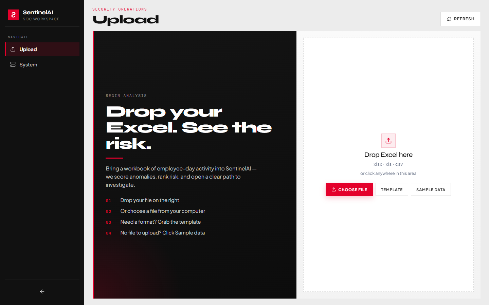
</p>
<p align="center"><em>Upload — Excel ingest or sample batch</em></p>

<p align="center">
  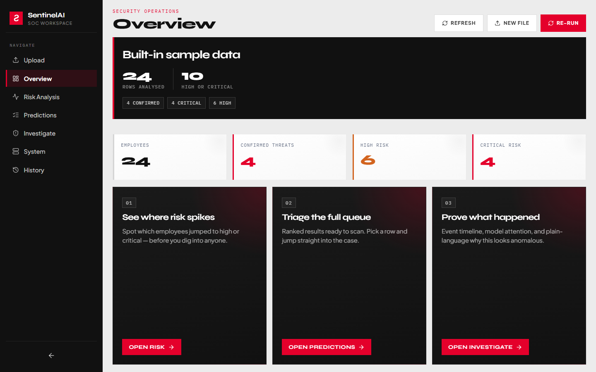
</p>
<p align="center"><em>Overview — batch stats and next-step workflow</em></p>

<p align="center">
  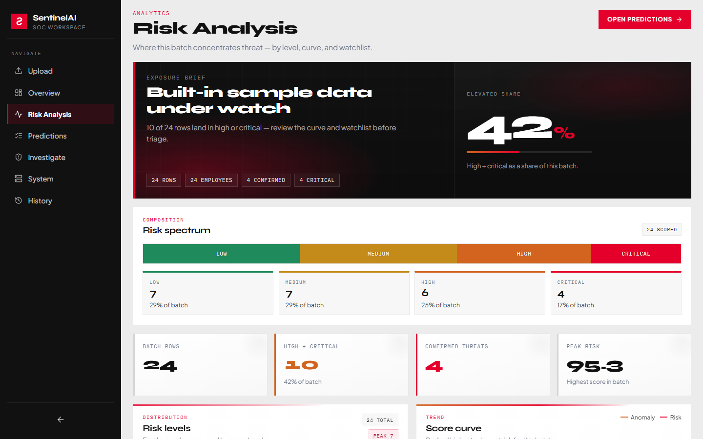
</p>
<p align="center"><em>Risk — exposure brief, spectrum, charts, watchlist</em></p>

<p align="center">
  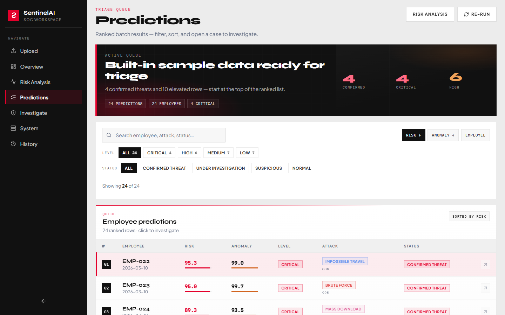
</p>
<p align="center"><em>Predictions — filterable triage queue</em></p>

<p align="center">
  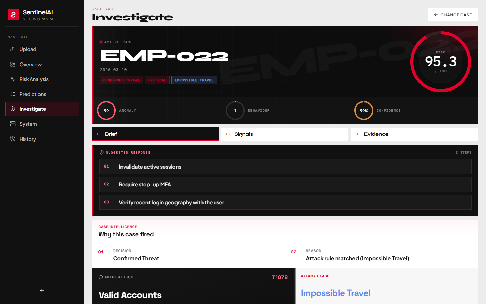
</p>
<p align="center"><em>Investigate — case vault with suggested response and intelligence</em></p>

<p align="center">
  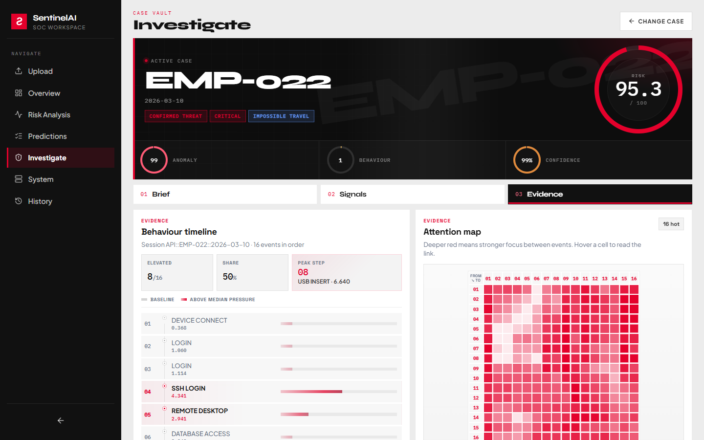
</p>
<p align="center"><em>Evidence — behaviour timeline and attention map</em></p>

<p align="center">
  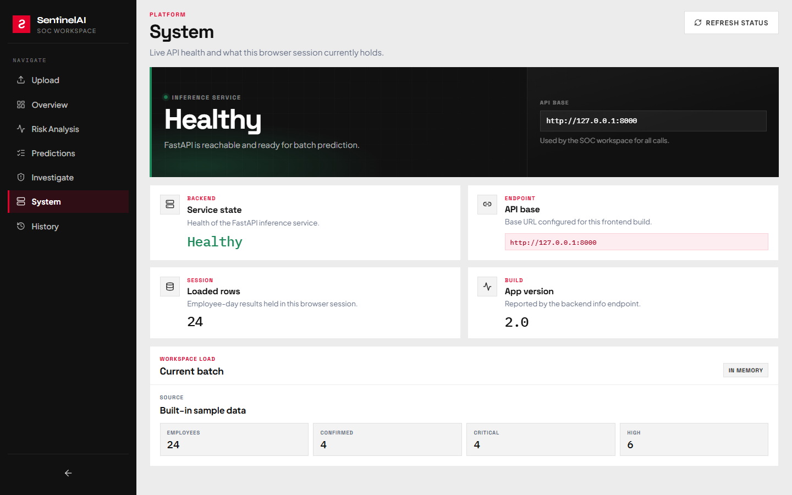
</p>
<p align="center"><em>System — API health and session load</em></p>

<p align="center">
  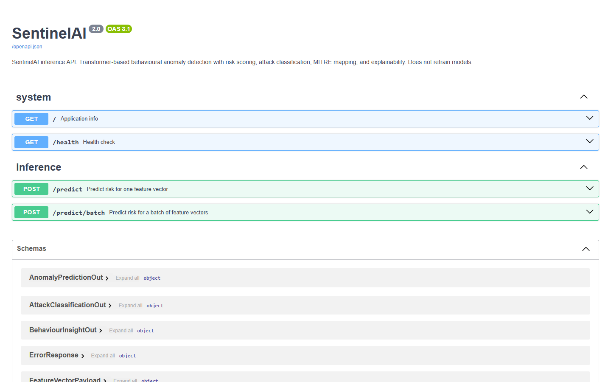
</p>
<p align="center"><em>API docs — interactive OpenAPI at <code>/docs</code></em></p>

To refresh screenshots with the stack running:

```bash
cd docs
node capture-screens.mjs
```

Diagrams also in-repo:

- 
- 

---

## Design notes (SOC UI)

- Brand: Hitachi-inspired red (`#E4002B`) on ink / light mist surfaces  
- Type: Space Grotesk (headlines), Plus Jakarta Sans (UI), IBM Plex Mono (scores / IDs), Syne (display accents)  
- Investigate stages use motion for page transitions; respect `prefers-reduced-motion`

---

## Troubleshooting

| Symptom | Check |
|---------|--------|
| `/predict` returns 503 | `SENTINELAI_MODEL_PATH` missing or file not found; train or prepare a model |
| Frontend cannot reach API | `VITE_API_BASE_URL`, CORS (Vite on `5173`), backend running |
| Empty Investigate page | Load a batch and select a prediction row first |
| Attention unavailable | Ensure the Behavioural Transformer artifact loaded successfully |

---

## Future improvements

- Model registry / versioning for detector artifacts  
- Alert routing (ticket / email) for CRITICAL cases  
- Hardened CORS + reverse-proxy deployment guide  
- Role-based access for multi-analyst deployments  
- Persist concept-drift EWMA across API restarts (Redis / DB)  

---

## License

Provided for academic demonstration and portfolio use.

```text
MIT License

Copyright (c) 2026 SentinelAI contributors

Permission is hereby granted, free of charge, to any person obtaining a copy
of this software and associated documentation files (the "Software"), to deal
in the Software without restriction, including without limitation the rights
to use, copy, modify, merge, publish, distribute, sublicense, and/or sell
copies of the Software, and to permit persons to whom the Software is
furnished to do so, subject to the following conditions:

The above copyright notice and this permission notice shall be included in all
copies or substantial portions of the Software.

THE SOFTWARE IS PROVIDED "AS IS", WITHOUT WARRANTY OF ANY KIND, EXPRESS OR
IMPLIED, INCLUDING BUT NOT LIMITED TO THE WARRANTIES OF MERCHANTABILITY,
FITNESS FOR A PARTICULAR PURPOSE AND NONINFRINGEMENT.
```

Replace this section if your course or organization requires a different license.
